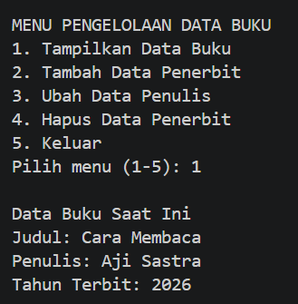
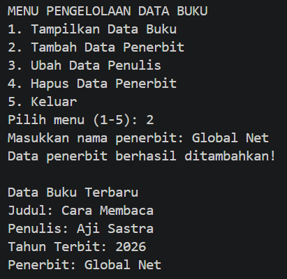
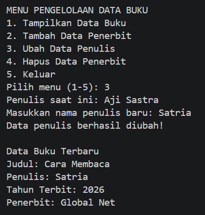
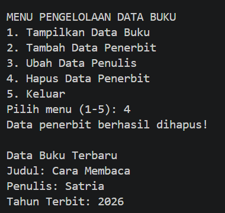
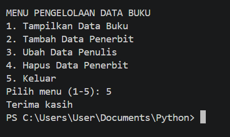

# Program Pengelolaan Data Buku Menggunakan Python (Dictionary)
Program sederhana berbasis Python untuk mengelola data buku menggunakan struktur data Dictionary.

1. Membuat Dictionary awal yang berisi judul penulis dan tahun terbit.
2. Menggunakan perulangan while True untuk menampilkan menu pengelolaan data secara terus-menerus.
3. Menampilkan data buku saat pengguna memilih menu tampilkan data.
4. Menambahkan data penerbit ke dalam Dictionary.
5. Mengubah data penulis pada Dictionary.
6. Menghapus data penerbit dari Dictionary.
7. Perulangan terus berjalan sampai pengguna memilih menu keluar.
8. Menampilkan data buku terbaru setiap kali dilakukan perubahan.

# Screenshot Output Program
1. Menu Tampilkan Data Buku

2. Menu Tambah Data Penerbit

3. Menu Ubah Data Penulis

4. Menu Hapus Data Penerbit

5. Menu Keluar Program

